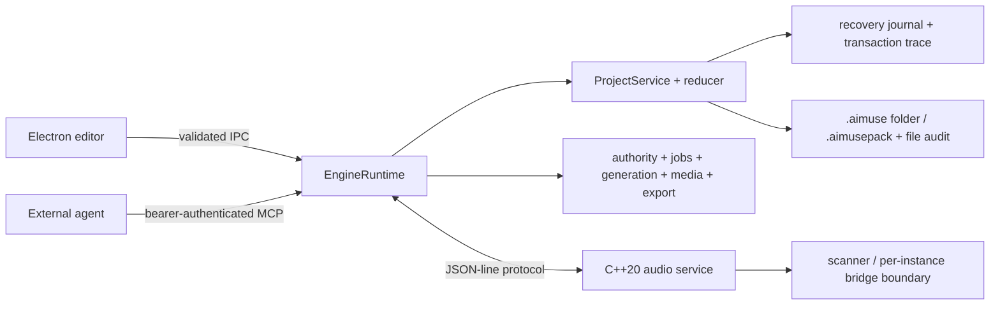

# Architecture

## Canonical runtime

`EngineRuntime` is the sole owner of committed project state. The renderer and every MCP session are clients of that runtime; neither keeps an independently authoritative project. The editor can detach without terminating the engine.

The renderer is sandboxed, uses context isolation, has no Node integration, and receives an explicit frozen preload API. Main-process IPC rejects calls that do not originate from the one trusted main frame. The production renderer uses `aimuse://app/` under a restrictive CSP.

## Project transactions

A `ProjectTransaction` contains a client idempotency key, project ID, actor metadata, label, operation list, expected entity revisions, and checkpoint policy. MCP actor identity, timestamps, revisions, and generation provenance are replaced or supplied by the server at the trust boundary.

Graph-affecting commits follow this sequence:

1. Parse and validate every operation, revision expectation, graph reference, and human lock.
2. Calculate the next immutable model and inverse operations without publishing it.
3. Ask the native service to prepare the proposed graph revision.
4. Append and `fsync` the recovery journal.
5. Commit the prepared native graph and publish the model/event.
6. Mirror the durable transaction trace. A mirror failure is reported as a warning because the recovery journal is already canonical.

A failed native prepare or journal append aborts the prepared graph and leaves the project unchanged. Per-project mutation queues prevent lost updates when UI and MCP transactions arrive simultaneously.

## Collaboration semantics

- Human gestures acquire entity and optional tick-range locks. Agent conflicts include retry guidance.
- Direct editing is the default. Broad agent transactions cause an immutable copy-on-write checkpoint under the automatic checkpoint policy.
- Undo/redo is scoped to the authenticated actor. A selective inverse applies only where the current value still matches that actor's forward edit, so later edits from another actor are not overwritten.
- Named variants keep a base snapshot and support comparison, discard, restore, and merge paths.
- Activity entries retain actor identity and client metadata. “Stop agents” cancels cancellable agent jobs and invalidates their active presence.
- The canonical snapshot retains the most recent 2,000 activity entries for bounded UI/reducer cost; the recovery journal and transaction trace remain the complete durable history.
- Successful folder saves append a destination-free `file.saved` record under `activity/file-audit.jsonl`. This durable file-I/O audit retains project, authenticated actor, timestamp and successful outcome, but is not reducer activity, does not increment the content revision and never becomes an undo entry.

## Time and media

The model uses 960 PPQ musical ticks, integer sample positions, tempo and meter maps, and project sample rates of 44.1, 48, or 96 kHz. Internal render samples are 32-bit float. Media is admitted only through import, recording/provider contracts, or render jobs; MCP operations do not accept inline media bytes.

Managed assets are content-addressed by SHA-256. A daily project is an incremental `.aimuse` directory with atomic JSON replacement, recovery/trace writes and a separately validated atomic file-audit log. `.aimusepack` uses ZIP64, rejects traversal and excessive archive expansion, and always requires a new destination when unpacking.

## Native boundary

The Windows runtime binaries `aimuse-audio.exe`, `aimuse-plugin-scanner.exe` and `aimuse-plugin-bridge.exe` implement or establish the existing protocol/process boundaries. Platform naming is now explicit, but macOS runtime targets remain disabled: the portable CMake lane builds only DSP/playback/parser tests and cannot stage an offline placeholder service. A future CoreAudio implementation must enter through `AIMUSE_ENABLE_COREAUDIO` and earn native evidence before the runtime/package gate can be removed. See [macOS development structure](MACOS_DEVELOPMENT.md).

The QA coordinator's remaining Windows filesystem TOCTOU interval is documented in [the handle-bound private-root checkpoint](QA10_WINDOWS_HANDLE_BOUNDARY.md). The in-process Node-API direction is approved for an opt-in provider-only prototype implementing the strict injected lease contract with documented handle APIs. Its retained real-Windows ABI-v2 run passes all eight native scenarios, explicit authority and independently contained-CWD checks. It remains absent from normal native staging and both coordinators. The [coordinator integration proposal](QA10_COORDINATOR_INTEGRATION_PROPOSAL.md) recommends a separately sealed/signed companion bundle plus nested bootstrap/operational leases, but production artifact discovery/integrity, ABI/loading, staging/signing, fail-closed mediation and package verification remain pending user authorization. The existing audio/plug-in helpers must not absorb this unrelated trust boundary.

The Windows alpha has retained exact WASAPI shared and explicit-exclusive endpoint evidence for one bounded subject, while endpoint hot-plug, recording, physical MIDI, complete graph DSP, delay compensation and real VST3/CLAP loading remain release blockers. macOS has only a declared `coreaudio` host-protocol identity and fail-closed build seam; no CoreAudio runtime is claimed. These boundaries keep canonical state outside the real-time process.
