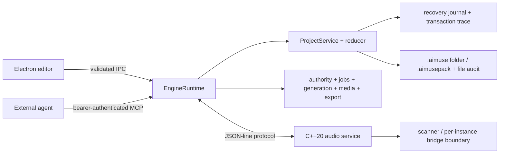

# Architecture

## Canonical runtime

`EngineRuntime` is the sole owner of committed project state. The renderer and every MCP session are clients of that runtime; neither keeps an independently authoritative project. The editor can detach without terminating the engine.

The renderer is sandboxed, uses context isolation, has no Node integration, and receives an explicit frozen preload API. Main-process IPC rejects calls that do not originate from the one trusted main frame. The production renderer uses `aimuse://app/` under a restrictive CSP.

## Project transactions

A `ProjectTransaction` contains a client idempotency key, project ID, actor metadata, label, operation list, expected entity revisions, and checkpoint policy. MCP actor identity, timestamps, revisions, and generation provenance are replaced or supplied by the server at the trust boundary.

Graph-affecting commits follow this sequence:

1. Parse and validate every operation, revision expectation, graph reference, and human lock.
2. Calculate the next immutable model and inverse operations without publishing it.
3. Ask the native service to prepare the proposed graph revision.
4. Append and `fsync` the recovery journal.
5. Commit the prepared native graph and publish the model/event.
6. Mirror the durable transaction trace. A mirror failure is reported as a warning because the recovery journal is already canonical.

A failed native prepare or journal append aborts the prepared graph and leaves the project unchanged. Per-project mutation queues prevent lost updates when UI and MCP transactions arrive simultaneously. Authenticated MCP direct/branch transactions, actor-scoped undo/redo, checkpoint/variant create/merge/discard, generation start/variation/accept/reject, plug-in parameter/preset/bypass/remove, WAV media analysis, and audition/consolidation render-job creation first share a four-lane actor-round-robin admission layer; pending render runtime does not keep those external-agent lanes occupied, while variant comparison, generation capabilities/inspection, plug-in catalog and media listing remain observations.

The canonical integrity boundary validates declared `EntityBase` metadata for every currently declared record family. Stored SFX deliverables, media assets, generation provenance, checkpoints and variants complete the most recent coverage, along with every existing operation that adds, registers, updates or deletes one of those records. Incoming metadata is checked before server normalization, so malformed IDs, revisions, timestamps or attribution cannot use normalization, mutation or target deletion to escape the schema; successful writes still replace server-owned attribution and timestamps exactly as before. Independently valid creation/update timestamps may be reverse ordered, record IDs need not equal collection keys, and creator/updater IDs need not resolve to an actor. Timestamp/revision progression, key coupling, actor lookup, repair, cleanup, retention and SFX/checkpoint/variant lifecycle policy remain separate decisions rather than implicit corruption rules.

Generation provenance has the same schema/reducer agreement for its immutable declared values: asset and reference ID shapes, provider/model/kind/prompt/lyrics/request/cost/currency/rights fields and the experimental flag are validated before reference lookup, registration or an update of an existing record. The schema still permits repeated reference IDs and empty optional lyrics/request/currency strings, so the reducer does too; referents must still exist. This is a corruption boundary, not a provider-kind compatibility matrix, reference/request uniqueness rule, billing interpretation, provider execution contract, migration, repair, retention, cleanup or retry policy.

Device records likewise validate their schema-declared track ID, format, optional built-in kind and plug-in ID/version/hash/vendor fields before relationship lookup, add/update/move/parameter mutation, direct deletion and track-cascade cleanup. This prevents a malformed descriptor from entering or disappearing through cleanup while preserving valid device ordering, attribution, parameter and inverse behavior. The schema deliberately permits empty optional descriptor strings, any plug-in hash text within 128 characters and independent format/built-in/plug-in fields; the reducer does not infer coupling, digest verification or native discovery/loading/hosting. Existing track/state-media relationships remain separate, and no routing-cycle, retention, repair or general cleanup policy follows from this boundary.

The same complete device lifecycle now shares the strict schema's numeric boundary for `latencySamples`: stored integrity, add/update, move, parameter mutation, direct delete and track-cascade cleanup require a nonnegative safe integer. Update retains its established merged-result validation, so an explicit valid latency replacement may repair that one mutable field; unrelated updates and every other existing-target path validate the malformed current value and reject it before mutation or cleanup. Existing target/revision, `EntityBase`, immutable descriptor, name/state, state-media/preset, parameter and track-cascade diagnostic order remains unchanged; `0` and `Number.MAX_SAFE_INTEGER`, explicit device order, attribution and inverses for valid lifecycles remain valid. This is stored device metadata only and defines no general repair, measurement, units, compensation/PDC, DSP, native discovery/hosting, routing, retention or broader cleanup behavior.

Automation lanes and points also share their strict-schema value boundary with the reducer. Lane track IDs, track/device target shapes, point-record/order ID shapes and state flags, plus point nonnegative safe-integer ticks, finite values, hold/linear/bezier curves and optional `-1..1` tension, are checked before registration, updates, point edits, direct deletion and device/track cleanup. Existing relationship and ordering behavior remains separate: lane creation preserves supplied point order, point upsert sorts by tick, a shaped device parameter ID need not resolve, and no target-specific range, cross-track ownership, curve/tension, map-key/entity-ID or chronology-on-create rule is inferred. Rejection adds no repair, retention or general cleanup semantics.

Timeline markers share one declared range boundary across stored integrity and marker add/update/delete. Tick and optional end tick must be nonnegative safe integers, and an end retains the established requirement to follow its start. Update validates both the existing target and proposed result, so a malformed marker cannot be repaired, and deletion cannot silently remove one. Operation paths retain missing-target/revision, `EntityBase`, duplicate-ID and merged text diagnostics before range validation; stored integrity retains complete-order, metadata and text precedence. Exact endpoints, equal-tick markers, reverse explicit order, point/range shape independent of `marker`/`region`/`cue`, attribution and inverses remain valid. Markers have no compound, split, cascade or cleanup producer, and this adds no chronology, uniqueness, total-range coupling, containment, overlap, snapping, kind/range coupling, migration, repair, retention or cleanup semantics.

Song sections use a distinct declared range boundary across stored integrity and section add/update/delete. Both required endpoints must be nonnegative safe integers and retain the existing non-empty forward-range rule. Update validates the existing target and proposed result, and deletion cannot hide a malformed range. Operation paths retain missing-target/revision, `EntityBase`, duplicate-ID and merged text diagnostics before the section range; stored integrity retains complete-order, metadata and text before range, then the existing independent energy check. Exact `0..Number.MAX_SAFE_INTEGER` endpoints, identical overlapping ranges, reverse explicit order, names and optional energy remain compatible. Sections have no compound, split, cascade or cleanup producer, and this boundary adds no chronology, order sorting, uniqueness, total-range coupling, containment, overlap, snapping, arrangement, lifecycle, migration, repair, retention or cleanup semantics.

Audio and MIDI clips share one declared base-numeric boundary across stored integrity and clip add/update/move/trim/split/delete or track-cascade paths; take-lane cleanup reaches the same canonical postcondition. Starts must be nonnegative safe integers, durations positive safe integers, gain finite within `-120..24`, fade durations nonnegative safe integers and an optional loop length a positive safe integer. Direct move, trim and split reject malformed values instead of allowing a schema-invalid result, and corrupt existing clips cannot be repaired or removed through those paths. Existing metadata, source/marker and explicit target/range/split diagnostics remain earlier on operation paths; stored integrity retains mutable fields before base numerics and audio source/markers afterward. Each declared endpoint remains independently valid, including totals beyond the safe-integer range, fades longer than a clip and loop lengths independent of clip duration or `loopEnabled`. No chronology, overlap, containment, snapping, cross-field coupling, musical interpretation, migration, repair, retention or general cleanup rule follows.

Audio clips share one declared source-descriptor boundary across stored integrity and clip add/update/move/trim/split/delete or track-cascade paths; take-lane cleanup reaches the same canonical postcondition. The asset ID must have the declared shape and resolve, source start/duration must be nonnegative/positive safe integers, and transpose must be finite within `-48..48`. Direct trim no longer rounds or clamps malformed sample input that the transaction schema rejects. Operation paths retain clip/marker metadata and explicit target/range/split diagnostics before source validation, while stored integrity retains media-reference then source-bound then marker ordering. Exact boundaries and repeated asset references remain valid independently of media kind or duration. No containment, marker partitioning, ownership, migration, repair, retention or general cleanup semantics follow.

Audio warp markers share their complete declared timing boundary across stored integrity and every existing marker-carrying clip path: add, update, move, trim, split, delete and track-cascade cleanup. Source samples and project ticks must be nonnegative safe integers. Operation paths check every marker's `EntityBase` before any marker timing, while stored integrity preserves its per-marker metadata/value ordering. Exact endpoints, duplicate marker IDs, explicit array order and reverse chronology remain valid. This boundary adds no chronology, uniqueness, containment, source-duration coupling, split partitioning, migration, repair, retention or broader cleanup behavior.

Comp segments share their complete declared-value boundary across stored integrity, upsert/replacement, direct deletion and the existing take-lane cleanup. Track/take-lane IDs must have declared shapes and still resolve to one lane on the same track; start/end ticks must be nonnegative safe integers and retain the existing non-empty forward-range rule. `EntityBase` precedes value checks, relationships precede ranges in integrity, the public upsert diagnostic stays generic, and cleanup checks every related segment's metadata before values. This adds no overlap, selection, ordering, containment, playback, retention, repair or broader cleanup policy.

Track kind is an immutable six-literal schema boundary shared by canonical integrity and reducer add/update/move/delete paths, including recursive deletion. Invalid kinds fail without publishing mutation or cleanup. Existing duplicate-ID, parent, mutable-field, master, reference and dependent-record checks retain their diagnostic precedence, and every valid kind keeps its existing hierarchy, clip, device, automation, routing, attribution and inverse behavior. This boundary defines no conversion, ownership, retention, lifecycle, repair or general cleanup semantics.

Track hierarchy is also a declared acyclic graph. `track.move` rejects moving a folder under its descendant before changing membership, the shared integrity validator rejects a reciprocal stored cycle even when every parent/child reference is locally consistent, and persisted folder reads reach that same validator through schema-1 migration. Rejection mutates neither the in-memory project nor corrupt `project.json` bytes; AIMuse does not silently repair the graph. This hierarchy-only contract does not decide audio-output/send/device routing cycles, deletion or retention, migration transforms, cleanup or recovery UX.

## Collaboration semantics

- Human gestures acquire entity and optional tick-range locks. Agent conflicts include retry guidance.
- Authenticated direct/branch edits, actor history, checkpoint/variant create/merge/discard, owner-scoped generation start/variation/accept/reject, plug-in parameter/preset/bypass/remove, WAV media analysis and audition/consolidation render-job creation share bounded fair admission. Each domain action costs one. Owner validation precedes job-specific admission, authenticated actor identity is cloned before queuing, and the per-project service queue remains the commit-order authority.
- Actor round-robin is a queued-work guarantee: a request that arrives while a lane is free can start immediately, but once all four lanes are occupied the scheduler rotates among actors with queued work instead of draining one actor first. Actual first queued arrival establishes that actor rotation; later work for an already queued actor remains FIFO and does not reseed it. A fixed-seed authenticated soak proves this over every admitted family, with observation calls bypassing saturation, human locks retaining priority, branch snapshot-metadata commits joining the same contiguous main-project order, and ordinary commits proceeding while injected provider/render jobs remain pending. Closing a session removes that actor’s presence and queued work before any domain effect; because the transport itself is deliberately closed, outstanding callers must not depend on receiving cancellation response bodies from that session.
- Queued checkpoint/variant cancellation performs no snapshot write. After admission, checkpoint creation writes its validated content-addressed snapshot before registration, and branch creation commits that base checkpoint before variant registration; a later failure therefore retains those established file/partial-commit semantics. Merge keeps its atomic graph/journal commit, while discard keeps its ordinary revision-checked transaction semantics.
- Queued generation start/variation cancellation creates no approval reservation or job and performs no credential/provider work; queued accept/reject cancellation performs no candidate disposition, asset-source registration or project mutation. Admitted job creation releases the lane before long provider execution, which remains owner-only and cancellable through the job lifecycle. Holding a lane for the provider duration is intentionally rejected because it would starve project edits and duplicate job cancellation.
- Generation acceptance keeps its established partial boundary: candidate media stays immutable, asset-source registration precedes the project commit, and the owned job’s accepted IDs change only after that commit succeeds. Duplicate acceptance remains a no-commit `duplicate`; rejection retains the candidate and stores its ID at most once. Scheduler cancellation guarantees zero generation service effects only while queued and never preempts running work.
- Running generation cancellation is terminal even when the provider ignores abort. The submitted request may still finish or charge; for an agent running under installed process authority, a valid late payload consumes its fulfilled-request budget unit, but a terminal check before candidate persistence prevents that payload from creating a candidate. If cancellation instead overlaps an already-started cache write, the owner result first reports `candidateCache: may-be-partial` and later settles to `retained` with the immutable candidate count when persistence succeeds. `result.partial.provider` records submitted, fulfilled and late-fulfilled request counts, while `partial.project: unchanged` means generation itself started no project transaction at cancellation settlement. The owner must inspect again; leaving or rejecting the retained candidate changes no project, while a later explicit acceptance remains a separate asset-source-before-commit mutation. Automatic retry, cache cleanup, provider preemption, zero-provider-effect and request-wide atomicity promises were rejected as false. This terminal settlement belongs only to generation and is not a policy for generic approved actions, session ownership, producer-specific media import or plug-in scan, which has its own catalog/helper boundary.
- Plug-in parameter, preset, bypass and removal each become one server-authenticated, revision-checked `ProjectService.apply` transaction after admission. Queued cancellation invokes no project transaction; admitted work retains human lock priority, per-project serialization and atomic graph/journal commit semantics. These actions are not generally idempotent, so backpressure or cancellation requires device/project re-observation before repetition.
- WAV analysis is admitted before reading its already registered project source. Queued cancellation therefore performs no source read, cache write or project transaction. Once running, it writes analysis JSON, waveform SVG and spectrogram SVG to the content-addressed managed cache before one atomic transaction registers all three assets; any completed cache outputs remain if another write or the later commit fails, while a rejected commit changes no project state and asset-source registration occurs only after success. Running work is not preempted and repetition is not idempotent.
- Media import remains outside fair admission because exact-path authority or approval precedes reads and its established service loop is a sequential set of independent per-file cache copies and project transactions. Authority-approved import now uses a distinct terminal continuation instead of generic settlement. Waiting cancellation releases approval capacity before any source read, cache copy or project transaction. Once running, cancellation does not preempt the current file: owner-only `partial.files` reports each index as pending/running/imported/warning plus `sourceRead`, `cache`, `projectTransaction` and `assetSource` phases. A resolved copy is retained even when parsing or the later transaction warns; returned lock/conflict/duplicate outcomes prove that file's transaction unchanged, while `engine-error` or a rejected promise remains `may-have-committed` because recovery-journal append can precede a later failure; a returned commit and synchronous source registration settle exactly. The loop continues after warnings, so earlier and later committed files remain and no request-wide atomicity, cleanup, rollback or automatic retry exists. Direct authority-allowed import stays synchronous/job-free. Adding fair-lane admission was rejected because no established policy spans the human approval wait or makes this multi-file continuation atomic. Audition and consolidation separately admit only authenticated render-job creation at cost one: queued cancellation creates no job, starts no render, writes no cache and invokes no project transaction; once admitted, the job does not keep its lane occupied while render remains pending. Holding a scheduler lane until render completion was rejected because the owner job already owns lifecycle and cancellation while ordinary project edits must remain eligible.
- Running audition/consolidation cancellation is terminal for the owner job but cooperative: it does not abort the render function or roll back an already-started `ProjectService` transaction. A render that completes after cancellation can leave its managed-cache WAV while starting no project transaction; an in-flight asset transaction can commit and register its source while preventing any later clip transaction; an in-flight consolidation clip transaction can also commit. Cancelled and failed results make the observed boundary literal through `partial.cache` (`retained` or `may-be-partial`) and `partial.project` (`unchanged`, `asset-committed` or `asset-and-clip-committed`); a non-cancelled exception remains a retryable failed job rather than hiding those effects. The caller must inspect the owned terminal job and re-observe project state before deciding to repeat. This deliberately rejects zero-running-effect, preemption, rollback, all-files atomicity and request-wide atomicity promises. Separation remains an explicit unavailable-adapter result.
- Export cancellation is also terminal for the owner job and cooperative, but retains an export-specific boundary. Cancelling while queued or waiting for authority starts no destination write or portable-pack save and releases the global approval gate. Once running, cancellation does not abort an in-flight renderer/write, remove a single- or multi-file output, roll back a portable-pack save or trigger an automatic retry. Late success or error cannot resurrect the job as completed/failed. Terminal cancelled and failed results record `partial.output` as `unchanged`, `may-be-partial` or `retained`; `partial.project` is `unchanged` except that a running portable pack reports `save-may-have-completed`. The owner must inspect the job, destination and—for a pack—the project before deciding to issue a new non-idempotent export. A mocked-audio authenticated listener proves this without starting the audio engine or native helpers.
- Authority-approved single-path project open uses its own discriminated continuation. Waiting owner cancellation releases the global approval gate before source read, workspace identity, opened-project or audio-controller effects. Once `ProjectService.open` starts, cancellation is terminal but non-preemptive and those phases initially remain uncertain. A returned `opened: []` retains its warnings but changes no workspace/project/controller state. A returned opened ID settles to retained/synchronized only when settlement-time project presence plus controller project/revision confirm both; otherwise concurrent workspace state remains conservative. A rejected promise is also conservative because `addProject` precedes `audio.synchronizeProject`, so synchronization or later publication can fail after workspace state is already retained. There is no rollback or automatic retry. Callers list the workspace and observe any retained project before repetition. Direct authority-allowed open remains synchronous with no job; compound project unpack retains the distinct contract below.
- Authority-approved project unpack has its own compound producer rather than inheriting single-path open or generic approved-action settlement. Waiting cancellation releases approval capacity before archive access, destination creation, sequential entry writes, extracted-project validation or `ProjectService.open`. Once running, cancellation is terminal but does not preempt any of those phases. Persistence emits non-interfering progress for archive-read start/completion, each discovered/started/completed directory or file entry, destination creation and best-effort removal, and validation. Owner-only job partials retain counts rather than unbounded archive filenames, distinguish `unchanged`, `root-created`, `may-be-partial`, `retained` and `removed` destination states, and report whether cleanup never started, is running, completed or failed. A validated extraction is retained before open begins. A returned open settles workspace/project/controller effects like the single-path producer; if controller synchronization rejects after workspace insertion, settlement-time destination-path identity can prove the opened project remains while controller state stays conservative. An archive-open failure now enters the existing removal attempt, but a failed removal can leave partial multi-file output, so archive-wide atomicity, guaranteed cleanup, rollback, preemption and automatic retry are explicitly rejected. Direct authority-allowed unpack keeps its synchronous `{ opened, warnings }` result and creates no job. Fair-lane admission is rejected because the human approval gate and compound file/open effects have no established atomic admission policy.
- Authority-approved project saves now use their own discriminated continuation rather than generic approved-action settlement. Cancelling while the continuation is waiting releases the global approval gate before destination writes, project clean-state/path publication or destination-free `file.saved` audit recording. Once `ProjectService.save` starts, cancellation is terminal but cooperative: it reports destination output as `may-be-partial`, project save as `save-may-have-completed` and audit as `may-have-been-recorded`, without preemption, cleanup or automatic retry. If the continuation later returns, its established ordering guarantees that destination output remains, the clean state/path is published and the authenticated audit is recorded; the cancelled job settles those effects to `retained`/`saved`/`recorded`. If it throws, destination files may be partial and the clean-state/audit publication point is not knowable from the rejected promise, so both remain conservative rather than falsely reporting zero effect. Re-observation is mandatory before another save. This producer-only contract deliberately does not flatten project open, unpack, media import, recording or authority-gated plug-in instantiation, whose authority and running partial effects differ.
- Authority-approved plug-in instantiate now has its own discriminated continuation instead of generic approved-action settlement. Waiting cancellation releases the approval gate before continuation and before project mutation. Once running, the continuation builds one authenticated descriptor `device.add` and awaits one per-project-serialized `ProjectService.apply`; it does not start a scanner, bridge, SDK instance or native host. Cancellation is terminal but non-preemptive. A returned `committed` device is retained, while an explicit returned `locked`, `conflict` or pre-transaction `approval-required` status proves this descriptor transaction did not commit. `engine-error`, `duplicate`, malformed output and an exceptional rejected promise remain `may-have-committed`/`may-have-been-added` because those outputs do not identify a safe zero-effect settlement point. Current reducer target validation still runs after approval, and lock collision now includes the nested new-device ID and destination track, so a human lock is checked before reduction. The authenticated actor supplies device creation/activity attribution, successful commit remains atomic, and no outcome is retried automatically. Direct allowlist-authorized instantiate stays synchronous and job-free. Fair-lane admission was rejected for this checkpoint because the human approval gate already precedes the continuation and no established backpressure policy spans that wait; generic settlement, native-host claims, preemption and rollback were likewise rejected.
- Session DELETE remains narrower than job cancellation: it removes presence and cancels that actor's scheduler-queued mutations, but it does not invoke `job_manage cancel` for already-created owner jobs. A caller that wants those jobs cancelled must do so before deleting its transport. Automatically cancelling them here was rejected for this checkpoint because their producer-specific running partial effects and future ownership/resumption policy are not one established cross-family contract.
- Plug-in catalog remains a globally shared observation, scan remains an owner-scoped catalog job, and authority-gated instantiate retains its existing approval continuation. Scan cancellation is terminal at the job layer but cooperative with already-started work. Its result separately records discovery, helper-call settlement, private candidate-result progress and catalog replacement. Candidate descriptors accumulate privately and never become a partial public catalog. Cancellation before final persistence leaves the prior catalog active; cancellation during the atomic write first reports `write-may-have-completed`, then settles to `replaced` if the writer resolves and the complete in-memory/project catalog is published, or `unchanged` if the atomic writer rejects. An uncancelled zero-candidate scan still replaces the catalog with an empty one. `nativeHelper: unconfirmed` means a helper call may still run or have externally invisible effects; `settled` confirms only the injected/production call promise, not native preemption, cleanup or absence of plug-in side effects. No automatic retry follows. An injected four-race authenticated listener proves job/catalog terminality without executing the helper; actual native cancellation/preemption remains uncertified. Scan and instantiate are deliberately not folded into device-edit admission because doing so would invent combined authority/backpressure, native or atomicity promises.
- Direct editing is the default. Broad agent transactions cause an immutable copy-on-write checkpoint under the automatic checkpoint policy.
- Undo/redo is scoped to the authenticated actor. A selective inverse applies only where the current value still matches that actor's forward edit, so later edits from another actor are not overwritten.
- Named variants keep a base snapshot and support comparison, discard, restore, and merge paths.
- Activity entries retain actor identity and client metadata. “Stop agents” cancels cancellable agent jobs and invalidates their active presence.
- The canonical snapshot retains the most recent 2,000 activity entries for bounded UI/reducer cost; the recovery journal and transaction trace remain the complete durable history.
- Successful folder saves append a destination-free `file.saved` record under `activity/file-audit.jsonl`. This durable file-I/O audit retains project, authenticated actor, timestamp and successful outcome, but is not reducer activity, does not increment the content revision and never becomes an undo entry.

## Time and media

The model uses 960 PPQ musical ticks, integer sample positions, tempo and meter maps, and project sample rates of 44.1, 48, or 96 kHz. Internal render samples are 32-bit float. Media is admitted only through import, recording/provider contracts, or render jobs; MCP operations do not accept inline media bytes.

Managed assets are content-addressed by SHA-256. A daily project is an incremental `.aimuse` directory with atomic JSON replacement, recovery/trace writes and a separately validated atomic file-audit log. `.aimusepack` uses ZIP64, rejects traversal and excessive archive expansion, and always requires a new destination when unpacking.

## Native boundary

Windows runtime binaries retain their `.exe` names and WASAPI behavior. On Darwin, the same C++20 targets build as extensionless `aimuse-audio`, `aimuse-plugin-scanner` and `aimuse-plugin-bridge` executables. `AIMUSE_ENABLE_COREAUDIO` compiles the pinned miniaudio backend and shared-device runtime; the build fails closed rather than staging an offline placeholder when CoreAudio is disabled. The scanner and bridge remain protocol/process shells with `sdkAdaptersReady: false`, so their presence is not a real plug-in-hosting claim. See [macOS development](MACOS_DEVELOPMENT.md) and the [gate matrix](MACOS_GATE_MATRIX.md).

The QA coordinator's remaining Windows filesystem TOCTOU interval is documented in [the handle-bound private-root checkpoint](QA10_WINDOWS_HANDLE_BOUNDARY.md). The in-process Node-API direction is approved for an opt-in provider-only prototype implementing the strict injected lease contract with documented handle APIs. Its retained real-Windows ABI-v2 run passes all eight native scenarios, explicit authority and independently contained-CWD checks. It remains absent from normal native staging and both coordinators. The [coordinator integration proposal](QA10_COORDINATOR_INTEGRATION_PROPOSAL.md) recommends a separately sealed/signed companion bundle plus nested bootstrap/operational leases, but production artifact discovery/integrity, ABI/loading, staging/signing, fail-closed mediation and package verification remain pending user authorization. The existing audio/plug-in helpers must not absorb this unrelated trust boundary.

The Windows alpha has retained exact WASAPI shared and explicit-exclusive endpoint evidence for one bounded subject. macOS now has bounded real-device shared-CoreAudio evidence and explicitly rejects exclusive mode without a shared fallback. Each native transport reply reports the most recent service callback duration divided by its frame budget plus a cumulative strictly-late callback count; the host replaces its telemetry only when that pair is finite/nonnegative and coherent, retaining legacy omission. This is deliberately service-thread timing rather than a driver/hardware-underrun assertion. Until a native MIDI backend exists, an MCP MIDI-input recording request fails before policy/approval or transport state can claim capture; a future permission grant remains necessary but cannot supply backend capability. Endpoint selection/hot-plug, recording, physical MIDI, complete graph DSP, delay compensation, hardware meters/underruns and real VST3/CLAP loading remain release blockers on their applicable platforms. These boundaries keep canonical state outside the real-time process.

The native audio binary now owns the pre-backend MIDI discovery seam. A backend may publish only nonempty opaque IDs qualified by `input` or `output`; a malformed or duplicate direction/ID snapshot is rejected without changing visibility. Canonicalized unchanged snapshots retain their generation, while any add/remove/replacement advances it. A future endpoint opener must reserve and immediately re-check the `(generation, id, direction)` lease, so removal or later reconnection never revives an earlier reference. The hello/controller report is visibility-only and currently always says disconnected with no ports. It conveys no authority, endpoint opening, capture/send, timestamp, hot-plug, recording/take, OS permission, device or platform-parity result.
